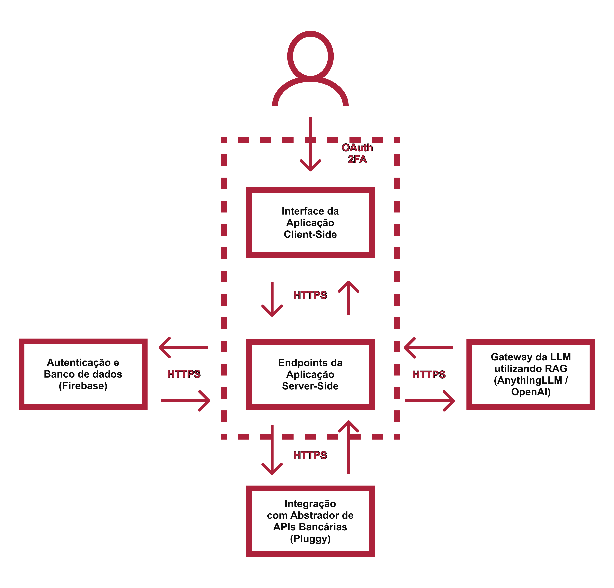
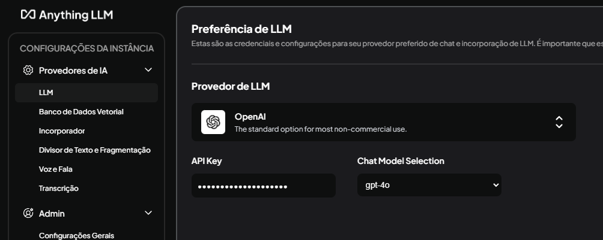
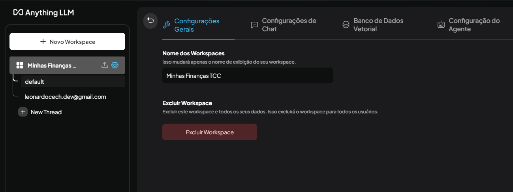
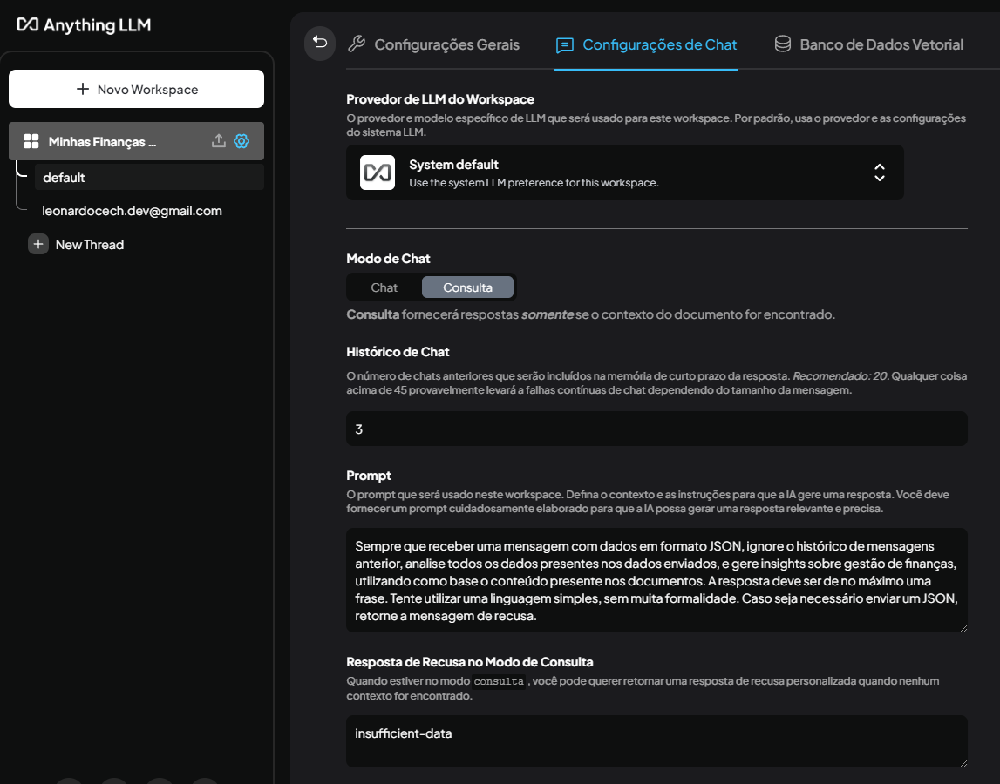
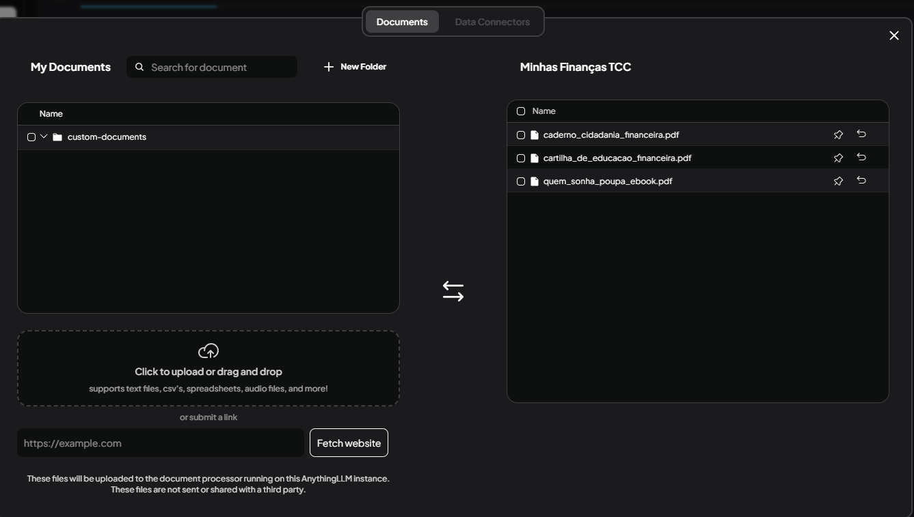
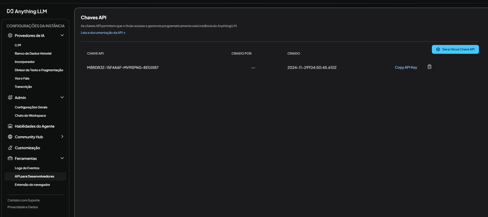

# 💸 Minhas Finanças

## 📚 Sumário

1. [🌟 Motivação](#-motivação)
3. [🛠️ Arquitetura do Projeto](#-arquitetura-do-projeto)
5. [🤖 Inteligência Artificial no Minhas Finanças](#-inteligência-artificial-no-minhas-financas)
6. [🛠️ Ferramentas e Dependências](#-ferramentas-e-dependências)
7. [📈 Metodologia Utilizada](#-metodologia-utilizada)
8. [⚙️ Configurações Necessárias](#-configurações-necessárias)

---

## 🌟 Motivação

O **Minhas Finanças** foi desenvolvido para facilitar o entendimento de gastos pessoais, sendo simples, prático, e contando com dicas geradas à partir de materiais educativos, utilizando Inteligência Artificial.

**Fatos Relevantes:**
- *"Inadimplência é reflexo da falta de educação financeira, aponta estudo – CNDL e SPC Brasil indicam que 35% dos brasileiros inadimplentes não fazem controle de gastos, e 42% consideram seu conhecimento sobre gestão regular."* - Por Revista Consumidor Moderno, em 9 de julho de 2024.​
- *"Falta de educação financeira aumenta desigualdade em era de instabilidade – Nos últimos anos, o cartão de crédito se consolidou como o tipo de dívida mais comum entre os brasileiros"* — Por Revista Exame, em 15 de julho de 2022.

---

## 🛠️ Arquitetura do Projeto



### **🧩 Estrutura Geral**

1. **Back-end (Python & FastAPI)**:
   - APIs REST para gerenciar os dados, autenticação, integrações e regras de negócio.

2. **Front-end (React)**:
   - Interface de usuário para vizualição de seus dados financeiros.

3. **Inteligência Artificial (AnythingLLM & OpenAI ChatGPT-4o)**:
   - IA que processa os dados de transações do usuário e fornece recomendações.

---

## 🤖 Inteligência Artificial no Minhas Finanças

### ❔ Como o Minhas Finanças Recomenda Dicas Financeiras?

Assim que o usuário adiciona uma conexão bancária, o Client envia um JSON contendo o histórico de transações para o Anything LLM, que processa as transações e fornece dicas financeiras, consultando os materiais educativos e os dados de credibilidade.

---

## 🛠️ Ferramentas e Dependências

### **Back-end**
- **[Python](https://www.python.org/)** & **[FastAPI](https://fastapi.tiangolo.com/)**
- **[Google Cloud Platform Firestore DB](https://firebase.google.com/docs/firestore?hl=pt-br)**
- **[Google Cloud Platform Firebase Authentication](https://firebase.google.com/docs/auth?hl=pt-br)**
- **[Pytest](https://docs.pytest.org/en/7.4.x/)** (para testes)
- **[Pluggy API](https://pluggy.ai/)**

### **Front-end**
- **[React](https://react.dev/)**
- **[Ant Design](https://ant.design/)** (para componentes)
- **[G2Plot](https://g2plot.antv.antgroup.com/)** (para gráficos)

### **IA**
- **[AnythingLLM](https://github.com/Mintplex-Labs/anything-llm)**
- **[OpenAI ChatGPT-4](https://openai.com/research/gpt-4)**
---

## 📈 Metodologia Utilizada

Para o desenvolvimento do projeto, foi utilizada a metodologia **Scrum**, com o uso de um **Kanban** para gerenciar as tarefas do projeto:

- **Colunas do Kanban**:
  - **Backlog**: Tarefas planejadas.
  - **Em Progresso**: Tarefas em desenvolvimento.
  - **Concluído**: Tarefas finalizadas.

Ferramenta utilizada: **Trello**.

---

## ⚙️ Configurações Necessárias

### **Aplicação Server-Side**
```bash
cd /Server
pip install uv
uv evenv
.venv\Scripts\activate
uv sync
python main.py
```

No diretório /Server, crie um arquivo `.env`:
``` yml
ENV="development"
MAIL-GUN-API-KEY="f53a40817de1ab76e4561604c75d2b6f-******-210679c5"
IPINFO-TOKEN="48c*******434"
TOKEN-SECRET-KEY="yDU*******4ZN"
FIREBASE-WEB-API-KEY="AIzaSyC***********aDCc2Pw"
BASE-TEST-USER={\"access_token\": null,\"email\": \"pytest.base@minhasfinancas.com.br\",\"password\": \"Corr3c7_P@$$W0RD\",\"fullname\": \"Pytest Temp User\",\"mfa_auth_app\": false,\"role\": \"ADMIN\",\"totp_secret\": \"UZC4MNQAUNHNLNBIPPRCQ6SJH732MX3P\"}
TEMP-TEST-USER={\"access_token\": null,\"email\": \"pytest.temp@minhasfinancas.com.br\",\"password\": \"Corr3c7_P@$$W0RD\",\"fullname\": \"Pytest Temp User\",\"mfa_auth_app\": false,\"role\": \"ADMIN\",\"totp_secret\": \"NTX2YR2WHIEQ27G3REAFYRFIHUC7JGJ6\"}
ANYTHING-LLM-HOST="http://localhost:3001"
ANYTHING-LLM-TOKEN="M8RDB3Z-**********-8E0JX87"
PLUGGY-CLIENT-ID="2db0a941-********-f3dd3a5f238a"
PLUGGY-CLIENT-SECRET="43816a97-******-e6994459cf14"
```

### **Front-end**
```bash
cd /Client
npm install
npm start
```

No diretório /Client, crie um arquivo `.env`:
``` yml
PORT=3002
``` 


### **IA**

O download do Anything LLM está disponível em [https://anythingllm.com/](https://anythingllm.com/)

* Após o download, configure o provedor de IA (é necessário possuir uma chave de API da OpenAI):


* Agora, configure um workspace com o nome "Minhas Finanças TCC", isso fará com que o identificador gerado seja "minhas-finanças-tcc":


* Configure um prompt base para utilizar a skill RAG do ChatGPT:


* Na lateral esquerda, onde aparece o nome do workspace, clique no ícone de upload para enviar os arquivos de consulta:


* Por fim, gere uma chave de API, que será utilizada para consumir o Anything LLM (Clicando em "Leia a documentação da API", é possível acessar a documentação Swagger da API):

---